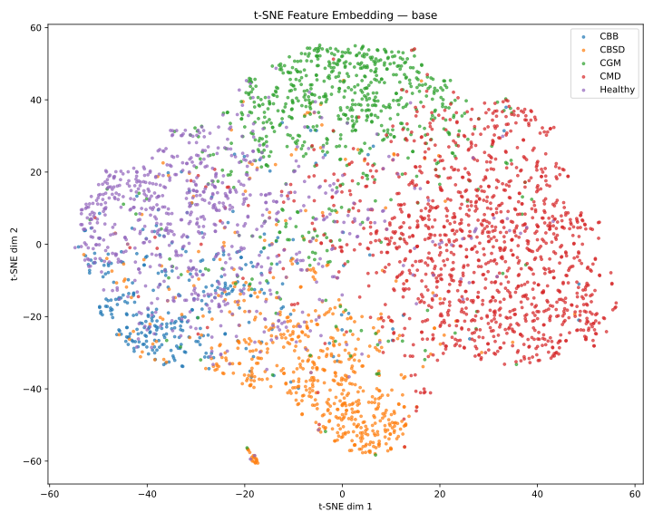
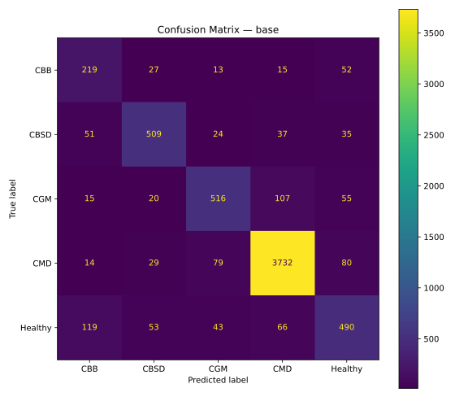
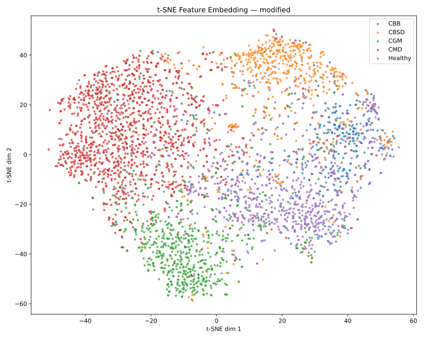

# Cassava Leaf Disease Classifier

A fine-tuned EfficientNetB0 classifier for automated cassava leaf disease detection across 5 categories: Cassava Brown Streak Disease (CBSD), Cassava Green Mite (CGM), Cassava Mosaic Disease (CMD), Cassava Bacterial Blight (CBB), and Healthy leaves.

---

## Model Architecture

The base EfficientNetB0 backbone is extended with several components motivated by disease-specific visual characteristics:

**CBAM Attention (Channel + Spatial)**
Inserted before global pooling to focus on diagnostically relevant regions. Channel attention learns which feature maps correspond to disease-specific textures (vein patterns, lesion edges, mosaic patterns). Spatial attention reweights spatial locations, directly addressing the uniform full-image activation observed in baseline GradCAM analysis.

**Generalized Mean Pooling (GeM)**
Replaces standard average pooling with a learnable pooling exponent. Unlike average pooling which weights all spatial locations equally, GeM emphasizes the strongest activations — preserving lesion-specific signal that average pooling would dilute against healthy background tissue.

**Auxiliary Supervision Head**
Attached at the 2/3 depth point of the backbone (MBConv block 5, 112 channels) to encourage mid-level feature discriminability, with a gradual loss weight ramp to avoid destabilizing early training.

**Multi-Sample Dropout**
Five parallel dropout heads (p=0.20 to p=0.40) with averaged logits, applied after BatchNorm normalization to stabilize statistics across dropout masks.

**Projection Head + Supervised Contrastive Loss**
A lightweight MLP projector (1280 → 256 → 128, L2-normalized) produces embeddings for SupCon loss. Inverse-frequency anchor weighting prevents the majority class (CMD, 65% of data) from dominating contrastive gradient updates, improving minority class cluster separation in embedding space.

---

## Augmentation Pipeline

Augmentation is **class-conditional** — transforms are selected based on disease-specific visual symptoms rather than applied uniformly:

**CBB (Cassava Bacterial Blight)**
CBB's diagnostic signature is hard-edged, angular, vein-bounded lesions with a yellow halo. Standard color and blur augmentations destroy this signal. CBB images receive edge-amplifying transforms only: CLAHE for local contrast enhancement, Sharpen for vein boundary accentuation, and mild bidirectional saturation variation. No hue shift, no blur.

**All Other Classes**
Receive standard photometric augmentation: mild brightness/contrast variation, bidirectional saturation shift, CLAHE, low-sigma Gaussian blur replaced with ISONoise to avoid softening vein structures critical for CBSD identification.

**Shared Geometry**
All classes share the same geometric pipeline: RandomResizedCrop (scale 0.92–1.0 to preserve lesion scale information), horizontal/vertical flip, SafeRotate (±20°), and mild ElasticTransform to simulate CMD/CGM leaf curl.

The tight crop scale floor (0.92) is deliberate — CGM vs CMD confusion is partially a scale problem (tiny mite punctures vs large mosaic patches), and aggressive crops collapse that discriminative scale signal.

---

## Training Details

| Component | Value |
|---|---|
| Backbone | EfficientNetB0 (ImageNet pretrained) |
| Input resolution | 224 × 224 |
| Optimizer | Adam (lr=1e-4, weight_decay=1e-4) |
| Scheduler | OneCycleLR (max_lr=1e-4, pct_start=0.1) |
| Loss | CrossEntropyLoss + auxiliary CE + SupCon |
| CE label smoothing | 0.05 |
| Class weighting | sklearn balanced weights |
| Batch size | 64 (effective 256 with gradient accumulation ×4) |
| Mixed precision | AMP (float16) + GradScaler |
| Memory format | channels_last |

**Loss schedule:**
- Auxiliary head weight ramps 0 → 0.3 over epochs 3–18
- SupCon weight ramps 0 → 0.1 over epochs 5–25
- CE remains the dominant signal throughout (implicit weight 1.0)

---

## Inference

Inference uses **Test-Time Augmentation (TTA)** — each image is passed through the model N times with different augmentations and the softmax probabilities are averaged:

```python
from inference import load_model, TTA

device = torch.device("cpu")
model  = load_model("Modified_EffNet_saved_model.pth", device)
tta    = TTA(model, device, n_aug=5)

# accepts file path, numpy array, or PIL Image
result = tta.predict("leaf.jpg")
# {
#   "class_name": "CBB",
#   "confidence": 0.7823,
#   "all_probs": {"CBB": 0.7823, "CBSD": 0.0412, ...}
# }
```

---

## Interpretability

**GradCAM** and **Guided Backpropagation** are implemented for model interpretability. GradCAM analysis was used iteratively during development — the progression from uniform full-image activation in the baseline to spatially focused attention in the final model confirmed that architectural changes (CBAM, GeM) produced genuine feature localization rather than dataset shortcut learning.

**t-SNE embedding analysis** on the 1280-dim feature space was used to diagnose class imbalance effects on embedding geometry. The modified model shows meaningfully better minority class cluster separation compared to the baseline, particularly for the CBB/Healthy boundary which represents the hardest confusion pair in the dataset.

---

## Results

### Base



### Modified



The baseline EfficientNetB0 with minimal augmentation achieves higher overall 
classification accuracy on this dataset. The modified architecture with CBAM, GeM, 
and Supervised Contrastive Loss demonstrates meaningfully improved feature separation 
in embedding space (confirmed by t-SNE analysis) but does not consistently translate 
to better classification performance under the current training configuration.

Key observations:
- CMD recall regressed in the modified model, attributed to SupCon contrastive 
  gradients disrupting CMD's decision boundary with CGM and CBSD
- CGM classification is equivalent between models, suggesting crop scale 
  preservation successfully addressed the CGM/CMD scale confusion
- Embedding geometry is demonstrably better in the modified model despite lower 
  classification accuracy — suggesting the classification head is not fully 
  exploiting the improved representation
- CBB/Healthy confusion persists in both models, consistent with the known visual 
  ambiguity of early-stage CBB symptoms


The baseline EfficientNetB0 with minimal augmentation achieves higher overall 
classification accuracy on this dataset. However, with natural variations, such as 
photo quality and color profiles, clean images are not always a guarantee. Thus,
the focus of the modified model was to improved generalized performance.
The modified architecture with CBAM, GeM, and Supervised 
Contrastive Loss demonstrates meaningfully improved feature separation in embedding 
space (confirmed by t-SNE analysis) but does not consistently translate to better 
classification performance under the current training configuration. 

This can likely be attributed to two things, a harder dataset with few examples and label smoothing 
to influence results. The harder dataset naturally demands stronger feature separation and learning 
key identifiers as opposed to a less transformed dataset. The spatial and channel attention mechanisms 
were specifically selected due to their ability to aid with feature extraction. The aux head was another
tool to force earlier feature development such that the model can fine tune better, which was evident.
Thus, we see generally improved separation, though both models did struggle with CBB. 

This leads into the next limitation which did affect both models, 
the severe class imbalance. With such few examples for other diseases 
relative to CMD, both models struggled with false reporting and incorrect diagnoses. 
The modified model was generally more consistent due to mechanisms like SupConLoss,
label smoothing, GeM, etc. to help prevent overconfidence and yield better results. 
However, the lack of genuinely hard cases for the leaves which look similar to other disease
have limited the amount of learning which may realistically be done and ability to exploit architecture improvements, an observation
additionally noticed teacher model's inability to achieve strong accuracy and convergence in the less represented
classes. This can be seen with the CBB, CBSD and Healthy examples having very blurred boundaries.
Thus, the modified model is not inherently worse as with such a small imbalanced dataset, a limitation based on realistic
capabilities relative to model size has likely been achieved. However, with the added upside of generalization, the
modified model is overall a solid improvement.

Regardless, this was quite a fun project being able to explore model distillation, as with my RL Coding Agent, I
felt that model distillation was a potential route to look into as teaching the smaller model was a pain point
without much reference of what a good response was. 

---

### Future Work

- Ablation studies isolating the contribution of CBAM, GeM, and SupCon individually
- Knowledge distillation from the trained EfficientNetB4 teacher into the B0 student
- External data augmentation for minority classes (CBB, CBSD) to address the data ceiling
- Test-Time Augmentation evaluation on the held-out test set

## Dataset

Training and validation data from the [Cassava Leaf Disease Classification](https://kaggle.com/competitions/cassava-leaf-disease-classification) Kaggle competition (Makerere University AI Lab).

Class distribution: CMD 65%, CBSD 15%, CGM 15%, Healthy 10%, CBB 5% — severe imbalance addressed through class-weighted loss and SupCon inverse-frequency anchor weighting.

---

## References

- Tan, M. & Le, Q.V. EfficientNet: Rethinking Model Scaling for CNNs. ICML 2019.
- Khosla et al. Supervised Contrastive Learning. NeurIPS 2020.
- Woo et al. CBAM: Convolutional Block Attention Module. ECCV 2018.
- Radenović et al. Fine-tuning CNN Image Retrieval with No Human Annotation (GeM). TPAMI 2018.
- Mwebaze et al. iCassava 2019 Fine-Grained Visual Categorization Challenge. arXiv:1908.02900.

---

## License

CC BY 4.0